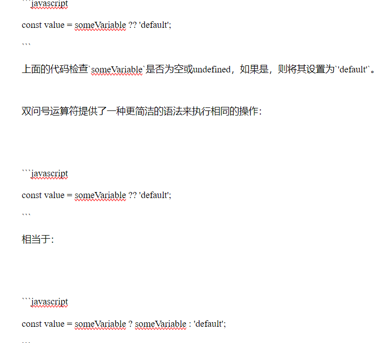

# 学习总结

学习内容总结

## css的has选择器

``` js
parent:has(selector) {
    /* 样式规则 */
}
// parent：表示父元素的选择器。
// selector：表示你希望在父元素中找到的子元素的选择器。

```
[学习地址](https://www.runoob.com/cssref/css-sel-has.html)

## js的宏任务微任务

  - 事件循环机制：
  
    1. 执行全局代码：当 JavaScript 代码第一次运行时，首先会执行同步代码，这些代码被当作一个宏任务。
   
    2. 检查微任务队列：一旦宏任务完成，事件循环会检查并执行微任务队列中的所有任务，直到队列为空。
   
    3. 执行下一个宏任务：如果微任务队列为空，事件循环会从宏任务队列中取出下一个任务并执行。
   
    4. 重复上述步骤：这个过程会不断循环，直到所有任务执行完毕。
   
  - 宏任务和微任务的执行顺序：
  
    - 微任务总是在当前宏任务结束后立即执行，优先级高于下一个宏任务。
  
    - 如果在微任务中再次添加微任务，这些新添加的微任务会在当前微任务队列完成后立即执行。
  
  - 常用的宏任务微任务
  
    - 宏任务：setTimeout  setInterval UI 渲染 I/O 操作
  
    - 微任务：Promise.then、Promise.catch、Promise.finally
  
## useRef使用场景

  它可以用于在函数组件中存储可变值，并且在组件重新渲染时保持不变。

  - 使用场景：
  
    1. 访问 DOM 元素：可以使用 useRef 来获取并操作 DOM 元素，比如设置焦点、测量元素尺寸等。
   
    2. 存储任意可变值：可以使用 useRef 来存储任意可变值，而不触发组件的重新渲染。
   
    3. 缓存上一次的值：可以使用 useRef 来缓存上一次渲染时的值，比如在 useEffect 中对比前后状态的变化。
   
    4. 在自定义 Hook 中共享数据：可以使用 useRef 在自定义 Hook 中共享数据，使得多个组件可以共享同一个数据源。
   
## useCallback使用场景

React 中的一个 Hook，用于优化性能并避免不必要的函数重新创建。

  - 使用场景：
  
    1. 性能优化：当需要将回调函数作为 prop 传递给子组件，并且这些回调函数依赖于某些特定的值时，可以使用 useCallback 来避免不必要的函数重新创建，从而提高性能。
   
    2. 依赖项改变时重新创建回调函数：当需要确保在依赖项改变时重新创建回调函数时，可以使用 useCallback 来创建记忆化的回调函数。
   
## nvm切换node版本

```js
// 安装指定版本的node
nvm install 版本号
// 切换到指定版本的node
nvm use 版本号
// 列出已安装的所有 Node.js 版本。
nvm list
// 显示当前正在使用的 Node.js 版本。
nvm current
```

## git常用命令

```js
git config --global user.name  // 查看用户名
git config --global user.name “serena”  // 修改用户名
git config --global user.email  // 查看邮箱
git config --global user.email serena@example.com  // 修改邮箱
git config --list  // 查看配置列表
git config --global --list --show-origin  // git全局设置文件地址查询
git --version  // 查看git版本
git init  // 初始化本地仓库
git remote add 自定义的远程仓库名 远程仓库地址  // 连接到远程仓库
git remote -v  // 查看远程仓库列表
git status  // 查看工作目录和暂存区的状态
git add .  // 提交所有文件到暂存区
git commit -m “注释”  // 将暂存区提交到仓库区
git pull //拉取代码
git push //推送代码
git reset --hard 版本号 // 切换到指定版本
git branch  // 查看分支列表
git branch [branchname]  // 创建分支
git checkout [branchname]  // 切换分支
git checkout -b [branchname]  // 创建&切换分支
git branch -d [branchname]  // 普通删除分支
git branch -D [branchname]  //强制删除分支
git merge [branchname]  //合并分支
git stash   // 暂存代码(会将当前分支上的工作推到一个栈中)
git stash apply  // 将栈顶的工作内容还原，但不让任何内容出栈
git stash pop  // 放出暂存的代码
git stash list  // 查看存储
git fetch -a 将本地同步成远程最新的
```

## ?? 运算符与 || 运算符的区别

  - ?? 运算符检查空值，而 || 运算符检查布尔值。
  
  - ?? 运算符始终返回一个值，而 || 运算符仅在至少一个表达式为真的情况下返回一个值。

    1. || 运算符对于所有的假值（例如：null、undefined、0、false、NaN 和空字符串）都会返回第二个操作数。而 ?? 运算符只会返回 null 或 undefined。
   
  

## 锚点

### 使用a标签实现锚点

  - `<a>` 标签的 href 属性值以 # 开头，后面跟着目标元素的 id。点击链接时，浏览器会滚动到具有对应 id 的元素位置。
  
  - 这种方式的优势在于不需要额外的 JavaScript 代码，但缺点是默认的滚动行为可能会比较突兀。如果需要更平滑的滚动效果，你可以使用 JavaScript 来自定义滚动行为，或者使用 CSS 属性 scroll-behavior: smooth。

### 使用scrollIntoView

  - `scrollIntoView` 是一个用于滚动元素到可见区域的 JavaScript 方法。它是在 `Element` 接口中定义的。
  ```js
  element.scrollIntoView([options]);
  ```

  - options（可选）是一个包含滚动行为的对象，可以包括以下属性：
      - behavior: 定义滚动的过渡效果。可以是 "auto"、"smooth" 或者不指定。
      - block: 定义垂直方向上的对齐方式，可以是 "start"、"center"、"end" 或者 "nearest"。
      - inline: 定义水平方向上的对齐方式，可以是 "start"、"center"、"end" 或者 "nearest"。
  - 示例：

  ```js
  const element = document.getElementById('myElement');

  // 将元素滚动到可见区域，默认滚动行为
  element.scrollIntoView();

  // 平滑滚动到可见区域
  element.scrollIntoView({ behavior: 'smooth' });

  // 将元素滚动到可见区域，垂直方向上对齐到底部
  element.scrollIntoView({ block: 'end' });

  // 将元素滚动到可见区域，水平和垂直方向上对齐到中心
  element.scrollIntoView({ block: 'center', inline: 'center' });
  ```

### 扩展：封装useScrollIntoView

  可能不止一个页面需要做这种锚点的功能，考虑到通用性，可以封装一个自定义 Hook `useScrollIntoView`。

  ```js
  import { useRef, useEffect } from 'react';

  function useScrollIntoView() {
    const targetRef = useRef(null);

    function scrollToTarget() {
      if (targetRef.current) {
        targetRef.current.scrollIntoView({ behavior: 'smooth' });
      }
    }

    useEffect(() => {
      // 在组件挂载后立即滚动到目标元素
      scrollToTarget();
    }, []);

    return {
      targetRef,
      scrollToTarget,
    };
  }

  export default useScrollIntoView;
  ```

  然后， 在React 组件中使用这个 hook，如下所示：

  ```js
  import React from 'react';
  import useScrollIntoView from './useScrollIntoView'; // 请替换成实际的路径

  function YourComponent() {
    const { targetRef: anchor1, scrollToTarget: scrollToAnchor1 } = useScrollIntoView();
    const { targetRef: anchor2, scrollToTarget: scrollToAnchor2 } = useScrollIntoView();

    return (
      <div>
        <div ref={anchor1}>Anchor 1</div>
        <div ref={anchor2}>Anchor 2</div>
        <button onClick={scrollToAnchor1}>Scroll to Anchor 1</button>
        <button onClick={scrollToAnchor2}>Scroll to Anchor 2</button>
      </div>
    );
  }

  export default YourComponent;

  ```

## for..in 和 for..of 的区别

  - `for...in` 语句用于遍历数组或者对象的属性（对数组或者对象的属性进行循环操作）。
  - `for in`得到对象的`key`或 数组,字符串的下标
  - `for of`和`forEach`一样,是直接得到值
  - `for of`不能用于对象

例：
  - 遍历对象：

  ```js
  const obj = {
        a: 1,
        b: 2,
        c: 3
    }
    for (let i in obj) {
        console.log(i)    //输出 ： a   b  c
    }
    for (let i of obj) {
        console.log(i)    //输出： Uncaught TypeError: obj is not iterable 报错了
    }
  ```

  - 遍历数组：

  ```js
  const arr = ['a', 'b', 'c']
   // for in 循环
   for (let i in arr) {
       console.log(i)         //输出  0  1  2
   }
   
   // for of
   for (let i of arr) {
       console.log(i)         //输出  a   b   c
   }
  ```

## 页面跳转方法

  - 跳转到新页签：`window.open(url)`;
  
  - 在当前页签跳转：`window.location.href = url`;

## js怎么精准1s后执行某事件

  - `performance.now()方法`  
  
    - 返回一个表示高分辨率时间的时间戳，单位是毫秒，但精度可以达到微秒级别。这个时间戳是从某个固定的时间点开始计算的，这个时间点通常是页面加载的开始时间（即性能时间原点）。

    - 比传统的 Date.now() 方法提供的毫秒（ms）精度更高。

  ```js
  // 如何使用performance.now()和循环检测精准在1s后执行某事件
  function preciseTimeout(callback, delay) {
    // start：记录当前的时间戳。
    // targetTime：计算目标时间戳，即从当前时间开始加上指定的延迟时间 delay。
    const start = performance.now();
    const targetTime = start + delay;
    
    // loop 函数会不断调用自身，直到当前时间戳 currentTime 达到或超过目标时间戳 targetTime。
    (function loop() {
      const currentTime = performance.now();
      if (currentTime >= targetTime) {
        callback();
      } else {
      // requestAnimationFrame 用于在下一个重绘周期之前调用 loop 函数，这样可以减少 CPU 占用并保持高精度。
        requestAnimationFrame(loop);
      }
    })();
  }

  // 使用示例
  preciseTimeout(() => {
    console.log('1秒后执行');
  }, 1000);

  ```

  - 异步方法

  ```js
  function preciseTimeout(delay) {
  // 创建一个新的 Promise，在目标时间到达时调用 resolve。
    return new Promise((resolve) => {
      const start = performance.now();
      const targetTime = start + delay;
      (function loop() {
        const currentTime = performance.now();
        if (currentTime >= targetTime) {
          resolve();
        } else {
          requestAnimationFrame(loop);
        }
      })();
    });
  }

  // 使用示例
  // 使用 async/await 语法来等待 preciseTimeout 返回的 Promise 完成后再执行后续代码。
  (async () => {
    await preciseTimeout(1000);
    console.log('1秒后执行');
  })();
  ```

## 如何在window上挂载js自定义事件

  - 使用 CustomEvent 构造函数创建自定义事件。你可以传递一个事件名称和一个可选的细节对象（包含事件的额外数据）。

  ```js
  // 创建自定义事件
  const customEvent = new CustomEvent('myCustomEvent', {
    detail: {
      message: '这是一个自定义事件'
    }
  });

  // 挂载自定义事件监听器
  window.addEventListener('myCustomEvent', (event) => {
    console.log('自定义事件被触发了！');
    console.log('事件详情:', event.detail);
  });

  // 触发自定义事件
  window.dispatchEvent(customEvent);
  ```

## 在url中取某个参数

- 使用`querystringify` 库方法：

```js
import qs from "querystringify";

const {field} = qs.parse(window.location.search);
```

- 使用js原生方法：

```js
const searchParam = new URLSearchParams(search);
const field= searchParam.get('field');
```

## 给url后面加一个查询参数

```js
const searchParam = new URLSearchParams(search);
const field= searchParam.get('field');
```

## 在dom的任何位置挂载div

- `createPortal` 允许你将 JSX 作为 children 渲染至 DOM 的不同部分。

- 示例：

```js
import { createPortal } from 'react-dom';

// ...

<div>
  <p>这个子节点被放置在父节点 div 中。</p>
  {createPortal(
    <p>这个子节点被放置在 document body 中。</p>,
    document.body
  )}
</div>
```